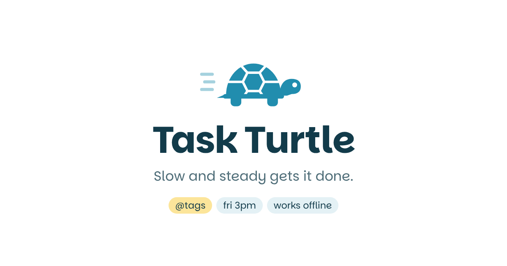

# Task Turtle

A calm, fast task list. Type it, tag it, check it off. Slow and steady gets it done.

**Live:** [turtle.shauna.dev](https://turtle.shauna.dev)



## What makes it different

- **One box does it all.** `Send invoice @clients fri 3pm !` becomes a task tagged `@clients`, due Friday at 3 PM, pinned as priority. A live preview under the box shows exactly what will be saved before you hit Enter.
- **@tags as project buckets.** Add as many as you like. Existing projects are suggested as you type. Click any tag to filter.
- **The turtle walks.** A small turtle moves along a trail as you finish today's tasks and reaches the finish when the day is done.
- **Undo, not "Are you sure?"** Deleting is instant, with a six-second undo.
- **Keyboard first.** `/` to type, `j` `k` to move, `x` to check off, `⌘K` for the command menu, `?` for everything else.
- **Local-first and offline.** Every change saves on the device immediately and works with no signal. Installable on your phone's home screen.
- **Optional sync.** Sign in with an emailed link and your tasks follow you across devices in real time. Guest tasks move into your account on first sign-in.
- **Slim and mobile-ready.** One-line rows, tap to expand, larger tap targets on touch screens, no zoom-on-focus on iPhone.
- **Accessible.** Real buttons and labels, screen reader announcements, visible focus, reduced-motion support.

## Stack

- Vanilla JavaScript, no framework. About 11 KB of JavaScript gzipped in guest mode.
- [Vite](https://vite.dev) with [vite-plugin-pwa](https://vite-pwa-org.netlify.app) for the offline service worker and install manifest.
- [Supabase](https://supabase.com) for sign-in, the Postgres database (row-level security, one person per row set) and realtime sync.
- Hosted on [Vercel](https://vercel.com).
- Type: [Parkinsans](https://fonts.google.com/specimen/Parkinsans). Color: cerulean `#218DAE` and butter `#FCE59A`, with every other shade derived from those two.

## How sync works

1. Every change writes to `localStorage` first, so the interface never waits on the network.
2. Changed task ids go into a small queue. When signed in and online, the queue is upserted to Supabase.
3. Conflicts resolve by last write wins, using each task's `updated_at`.
4. A realtime subscription applies changes from your other devices as they happen. The app also re-fetches when the tab regains focus, in case it missed anything while asleep.
5. Deletes are soft (`deleted = true`), which makes undo and cross-device deletes simple.

## Run it locally

```bash
npm install
npm run dev
```

Guest mode needs nothing else. To turn on sync, copy `.env.example` to `.env.local`, add your Supabase URL and publishable key, and run `supabase/migrations/0001_tasks.sql` in the Supabase SQL editor.

```bash
npm test         # parser tests
npm run build    # production build in dist/
```

## Keyboard shortcuts

| Key | Action |
| --- | --- |
| `/` or `n` | New task |
| `⌘K` / `Ctrl K` | Command menu |
| `j` / `k` | Move down / up |
| `x` | Check off or uncheck |
| `Enter` | Expand or collapse |
| `f` | Filter by the task's first tag |
| `Backspace` | Delete, with undo |
| `u` | Undo delete |
| `Esc` | Clear selection, filter or input |
| `?` | Show all shortcuts |

---

Designed and built by [Shauna](https://shauna.dev).
